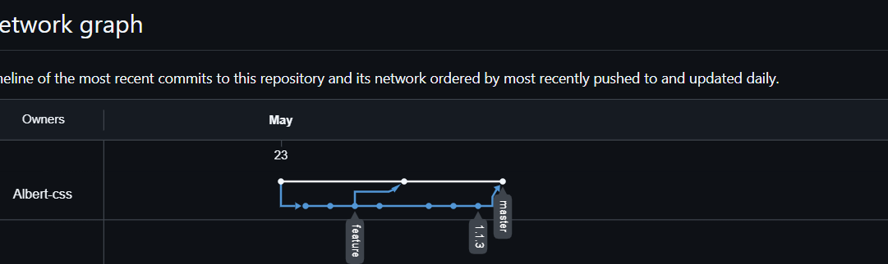

# Консольный калькулятор на Java

## Описание
Простое консольное приложение для математических операций.
Разработчик: Иван Иванов.

## Ссылки
* [Инструкция по установке](install.md)
* [История изменений (Changelog)](changelog.md)

## Граф ветвления

